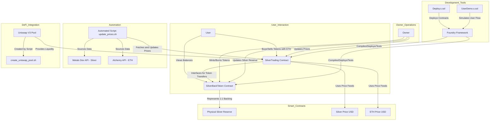

# eSILVST Codebase Map

## Overview
This document provides a detailed map of the eSILVST project codebase, outlining the file structure, purpose of each directory and file, and their interconnections. eSILVST is a silver-backed token system on the Ethereum blockchain, and this map serves as a guide to understanding the organization and functionality of the code.

## File Structure Map

The repository is organized into directories and files that support development, deployment, testing, and documentation of the eSILVST token system.

### Root Directory
Contains configuration files, utility scripts, and project documentation.

- **.cursorrules**: Guidelines for development, emphasizing precision, simplicity, thorough testing, and security best practices. It ensures developers execute exactly what is requested without adding unasked-for features.
- **.gitignore**: Lists files and directories excluded from version control, such as environment files with sensitive information ('.env'), build artifacts ('broadcast/', 'cache/', 'out/'), and dependencies ('lib/', 'node_modules/').
- **.gitmodules**: Specifies a submodule for 'lib/openzeppelin-contracts', linking to the GitHub repository for OpenZeppelin Contracts, used as a dependency for standard smart contract functionalities.
- **create_uniswap_pool.sh**: A shell script to create a Uniswap V3 pool for eSILVST on the Sepolia testnet. It automates minting tokens, creating and initializing a pool with a price, approving the Position Manager, and adding liquidity with ETH and eSILVST tokens.
- **foundry.toml**: Configuration file for the Foundry development framework, setting source and test directories, Solidity compiler version (0.8.20), optimizer settings (disabled), EVM version (Istanbul), RPC endpoints for Sepolia and Mainnet, and Etherscan API keys.
- **README.md**: Comprehensive project documentation, including deployment instructions, contract details, and usage guides for interacting with the eSILVST token system.
- **remappings.txt**: Provides path remappings for imports, mapping aliases like '@openzeppelin/' to 'lib/openzeppelin-contracts/' for easier dependency usage in smart contracts.
- **update_prices.sh**: A shell script for updating price feeds in the SilverTrading contract. It fetches silver prices from Metals Dev API and ETH prices from Alchemy API, converts them to an 8-decimal format, and updates the contract on either Sepolia testnet or Ethereum mainnet.

### lib/ Directory
Contains external dependencies managed as submodules.

- **openzeppelin-contracts/**: A submodule of the OpenZeppelin Contracts library, providing standard, secure implementations for ERC20, Ownable, and Pausable functionalities used in eSILVST contracts.

### script/ Directory
Houses scripts for deployment and user interaction demonstrations using Foundry.

- **Deploy.s.sol**: A Foundry script for deploying eSILVST contracts. It deploys `SilverBackToken`, sets an initial silver reserve of 1000 troy ounces, deploys `SilverTrading`, mints 500 tokens to the trading contract, and logs deployment details with Etherscan verification reminders.
- **UserDemo.s.sol**: A Foundry script demonstrating the token purchase flow. It simulates a user buying eSILVST tokens with a small amount of ETH (0.0003 ether), logging initial and final states of user balances and expected token returns.

### src/ Directory
Contains the core smart contracts for the eSILVST token system.

- **SilverBackToken.sol**: The main ERC20 token contract for eSILVST, representing 1 troy ounce of silver per token. It includes owner-controlled minting/burning, silver reserve updates, reserve ratio calculation, and pause functionality, using OpenZeppelin libraries for security and standards compliance.
- **SilverTrading.sol**: The trading contract for buying and selling eSILVST tokens with ETH. It uses price feeds for silver and ETH (initialized at $29.50/oz and $3,250/ETH), performs price conversions, and is pre-funded with tokens and ETH for immediate trading.

### test/ Directory
Includes test files for validating the functionality of the smart contracts.

- **SilverBackToken.t.sol**: Test file for `SilverBackToken`, covering minting and burning as owner, reserve updates, access control (non-owner reverts), reserve limit enforcement, pause functionality, and reserve ratio calculations.
- **SilverTrading.t.sol**: Test file for `SilverTrading`, testing token purchases with ETH, token sales for ETH, price update effects on exchange rates, and reverts for insufficient reserves, small amounts, and insufficient ETH in the contract.

## Architectural Map (Functional Components)

Below is a visual representation of the eSILVST system's architecture, showing how components interact within the codebase:

## Codebase Interconnections

- **Smart Contracts (src/)**: The `SilverBackToken.sol` and `SilverTrading.sol` are the core of the project. `SilverTrading` depends on `SilverBackToken` for token transfers and balance management, interfacing through a defined interface in the code.
- **Dependencies (lib/)**: Both contracts rely on OpenZeppelin Contracts for standard functionalities like ERC20 compliance and ownership control, mapped via `remappings.txt`.
- **Deployment and Automation (script/ and root scripts)**: `Deploy.s.sol` orchestrates the initial setup of both contracts, while `UserDemo.s.sol` simulates user interactions with `SilverTrading`. Scripts like `update_prices.sh` and `create_uniswap_pool.sh` extend functionality by automating price updates and DeFi integration.
- **Testing (test/)**: Test files directly correspond to their respective contracts, ensuring functionality through Foundry's testing framework as configured in `foundry.toml`.
- **Configuration (root files)**: Files like `foundry.toml` and `.gitmodules` define the development environment and dependency structure, critical for building and deploying the project.

## Summary
This codebase map provides a comprehensive view of the eSILVST project's structure and functional relationships. The repository is logically organized into core contracts, supporting scripts, tests, and dependencies, facilitating development, deployment, and interaction with a silver-backed token system on Ethereum. Understanding this map aids in navigating the code for maintenance, extension, or integration purposes.
