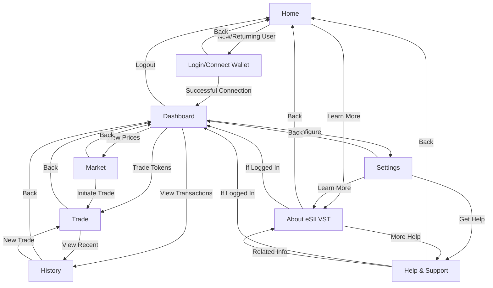

# eSILVST Wallet PWA Site Map

## Overview
This document outlines the site map for the eSILVST Wallet mobile-first Progressive Web App (PWA), detailing the primary pages, their hierarchy, and interconnections. The structure is designed to prioritize quick access to core functionalities like trading and balance checking, optimized for mobile users, while ensuring a logical and user-friendly navigation experience.

## Page Hierarchy (Text Representation)
- **Home (Landing Page)**
  - Entry point for new and returning users.
  - Links to:
    - **Dashboard** (Primary navigation hub after login)
    - **Login/Connect Wallet** (For authentication)
    - **About eSILVST** (Educational content)
- **Login/Connect Wallet**
  - Authentication page for wallet connection.
  - Links to:
    - **Dashboard** (Upon successful connection)
    - **Home** (Back navigation)
- **Dashboard** (Main User Interface)
  - Central hub displaying balances and key metrics.
  - Links to:
    - **Trade** (For buying/selling tokens)
    - **Market** (Price information)
    - **History** (Transaction records)
    - **Settings** (User preferences and security)
    - **Home** (Logout or back to landing)
- **Trade**
  - Dedicated page for trading eSILVST tokens.
  - Links to:
    - **Dashboard** (Back to overview)
    - **History** (View recent trades)
- **Market**
  - Page for real-time price data and trends.
  - Links to:
    - **Dashboard** (Back to overview)
    - **Trade** (Directly initiate a trade based on prices)
- **History**
  - Page for viewing past transactions.
  - Links to:
    - **Dashboard** (Back to overview)
    - **Trade** (Initiate a new trade)
- **Settings**
  - Configuration page for user preferences and security.
  - Links to:
    - **Dashboard** (Back to overview)
    - **About eSILVST** (Access educational content)
    - **Help & Support** (Additional resources)
- **About eSILVST**
  - Educational page explaining silver backing and token system.
  - Links to:
    - **Home** (Back to landing)
    - **Dashboard** (If logged in)
    - **Help & Support** (For further assistance)
- **Help & Support**
  - Resource page for tutorials, FAQs, and contact options.
  - Links to:
    - **Home** (Back to landing)
    - **Dashboard** (If logged in)
    - **About eSILVST** (Related educational content)

## Visual Representation (Mermaid Diagram)
To illustrate the interconnections and hierarchy more clearly, below is a Mermaid diagram of the site map:

## Detailed Page Descriptions and Content
- **Home (Landing Page)**: The initial entry point with a welcome message, a brief overview of eSILVST as a silver-backed token, and prominent buttons for "Connect Wallet" and "Learn More". Designed for quick onboarding.
- **Login/Connect Wallet**: A focused page for wallet authentication, supporting MetaMask and WalletConnect. Includes a back button to Home and redirects to Dashboard upon successful connection.
- **Dashboard**: The central hub post-login, displaying eSILVST and ETH balances, silver reserve ratio, and quick action buttons for trading. Features a bottom navigation bar (optimized for mobile) linking to Trade, Market, History, and Settings.
- **Trade**: A transaction-focused page with tabs for "Buy eSILVST" and "Sell eSILVST", showing input fields for amounts, estimated returns, gas fees, and a confirmation modal. Links back to Dashboard and History for context.
- **Market**: Displays real-time silver and ETH prices with optional charts for price trends over the last 24 hours or week. Includes a direct link to Trade for immediate action based on market data.
- **History**: Lists past transactions with filters for buy/sell and date range, each entry linking to Etherscan for verification. Provides a quick link to Trade for new transactions.
- **Settings**: Allows users to configure network settings (Sepolia/Mainnet), security options (session timeout), and view account details. Links to educational and support resources.
- **About eSILVST**: An informational page with content on silver backing, reserve ratios, and the project's mission, including videos or infographics. Connects to Help & Support for deeper inquiries.
- **Help & Support**: Offers tutorials, FAQs (e.g., "How to connect my wallet?"), and contact options for support. Links back to main navigation points for user convenience.

## Navigation and Interconnectivity Rationale
- **Mobile-First Navigation**: The bottom navigation bar on Dashboard and related pages (Trade, Market, History, Settings) ensures quick access to core features with thumb-friendly taps, adhering to mobile usability standards.
- **Hierarchical Flow**: The structure starts from Home to Login to Dashboard, ensuring users authenticate before accessing sensitive data, then branches into functional areas (Trade, Market) and support areas (Settings, About, Help).
- **Circular Links**: Pages like Trade, Market, and History are interconnected to encourage fluid movement between related actions (e.g., checking prices in Market, then trading in Trade, then reviewing in History).
- **Educational Support**: About and Help & Support are accessible from multiple points (Home, Settings, Dashboard) to ensure users can always find information on the unique silver-backed token concept.

## Summary
This site map for eSILVST Wallet PWA balances functionality with simplicity, ensuring users can easily navigate to perform key actions like trading while having access to necessary information and support. The structure is optimized for mobile users, prioritizing core features through a bottom navigation bar and logical interconnections between pages.
