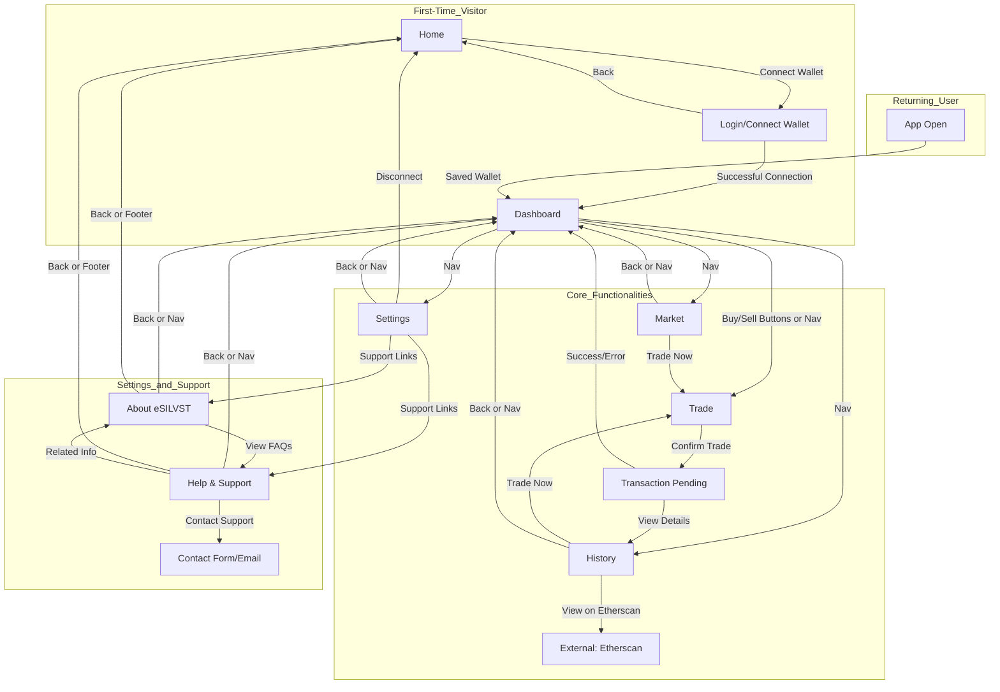

# eSILVST Wallet PWA User Flow

## Overview
This document maps out the different user flows for the eSILVST Wallet mobile-first Progressive Web App (PWA), detailing the paths users may take through the application. These flows cover key interactions from initial onboarding to core functionalities like trading, as well as support and account management. The purpose is to provide a clear understanding of user navigation and decision points within the app.

## User Flow Descriptions

### 1. First-Time Visitor (Onboarding Flow)
**Target User**: New users who have not yet connected a wallet or used the app.
- **Entry Point**: User accesses the app via a link, search, or direct URL, landing on the Home (Landing Page).
- **Flow**:
  - User views the Home page with a hero section promoting "Your Silver, Digitally Secured" and a "Connect Wallet" CTA.
  - User taps "Connect Wallet", redirecting to the Login/Connect Wallet page.
  - User selects a wallet provider (e.g., MetaMask or WalletConnect) and completes the connection process by signing a message to verify ownership.
  - Upon successful connection, user is redirected to the Dashboard, where they see their eSILVST and ETH balances, and are prompted with a short onboarding modal (e.g., "Welcome! Tap 'Trade' to buy eSILVST tokens.") to guide them to key actions.
  - User can then explore the app via the bottom navigation bar (Dashboard, Trade, Market, History, Settings).

### 2. Returning User (Direct Access Flow)
**Target User**: Users who have previously connected a wallet and return to the app.
- **Entry Point**: User opens the app (via PWA icon on home screen or URL) with a saved wallet connection.
- **Flow**:
  - App automatically detects the saved wallet connection and bypasses the Home/Login pages, directing the user straight to the Dashboard.
  - From the Dashboard, user can view balances and reserve ratio, and immediately access primary actions like "Buy eSILVST" or "Sell eSILVST" via quick action buttons.
  - User navigates to other sections (Trade, Market, History, Settings) using the bottom navigation bar for quick access to specific functionalities.

### 3. Trading Flow (Buy/Sell eSILVST Tokens)
**Target User**: Logged-in users wanting to trade tokens.
- **Entry Point**: User starts from the Dashboard.
- **Flow**:
  - User taps "Buy eSILVST" or "Sell eSILVST" on the Dashboard, or navigates to the Trade page via the bottom navigation bar.
  - On the Trade page, user selects the appropriate tab ("Buy" or "Sell"), enters the desired amount (ETH for buying, eSILVST for selling), and views the estimated return and gas fee.
  - User taps "Confirm Trade", triggering a confirmation modal with final details and a wallet signature request (e.g., via MetaMask).
  - After confirming the transaction, user sees a "Transaction Pending" status, followed by a success or error notification.
  - User can tap "View on Etherscan" for blockchain verification or return to Dashboard to see updated balances, or navigate to History to review the transaction.

### 4. Market Analysis Flow
**Target User**: Users interested in price trends before trading.
- **Entry Point**: User starts from the Dashboard.
- **Flow**:
  - User navigates to the Market page via the bottom navigation bar.
  - On the Market page, user views current silver and ETH prices, and selects a timeframe (24H, 7D, 30D) to analyze price trends via charts.
  - User taps "Trade Now" to jump directly to the Trade page with pre-selected "Buy" tab, or returns to Dashboard via the back arrow or navigation bar.

### 5. Transaction Review Flow
**Target User**: Users wanting to review past transactions.
- **Entry Point**: User starts from the Dashboard.
- **Flow**:
  - User navigates to the History page via the bottom navigation bar.
  - On the History page, user applies filters (Type, Date Range) to narrow down transactions, viewing a list of past trades with summaries.
  - User taps "View on Etherscan" on a specific transaction for detailed blockchain data, or taps "Trade Now" to initiate a new trade, redirecting to the Trade page.
  - User can return to Dashboard via the back arrow or navigation bar.

### 6. Account and Settings Management Flow
**Target User**: Logged-in users wanting to configure preferences or security.
- **Entry Point**: User starts from the Dashboard.
- **Flow**:
  - User navigates to the Settings page via the bottom navigation bar.
  - On the Settings page, user views connected wallet info, switches network (Mainnet/Sepolia), adjusts security settings (e.g., session timeout), or changes preferences (e.g., theme).
  - User can tap "Disconnect" to log out, returning to the Home page, or navigate to "About eSILVST" or "Help & Support" for additional information.
  - User returns to Dashboard via the back arrow or navigation bar.

### 7. Educational and Support Flow
**Target User**: New or existing users seeking information or help.
- **Entry Point**: User starts from Home (if not logged in) or any page via navigation or links.
- **Flow**:
  - User taps "Learn More" on Home or navigates to "About eSILVST" from Settings or footer links.
  - On the About eSILVST page, user reads about the silver-backed token concept, views infographics or videos, and taps "View FAQs" to access detailed answers in Help & Support.
  - Alternatively, user navigates directly to Help & Support via footer links or Settings.
  - On the Help & Support page, user searches for topics, browses quick links (e.g., "How to Connect Wallet"), expands FAQs, or taps "Contact Support" for further assistance.
  - User can return to Home, Dashboard (if logged in), or other pages via header or footer links.

## Visual Representation (Mermaid Diagram)
Below is a Mermaid diagram illustrating the primary user flows through the eSILVST Wallet PWA, showing key decision points and navigation paths.

## Summary
This user flow document outlines the primary paths users may take within the eSILVST Wallet PWA, covering onboarding for first-time visitors, direct access for returning users, trading processes, market analysis, transaction review, account management, and educational/support interactions. These flows are designed to minimize friction, provide clear navigation via a bottom bar for mobile users, and encourage key actions like trading while ensuring access to information and help resources.
